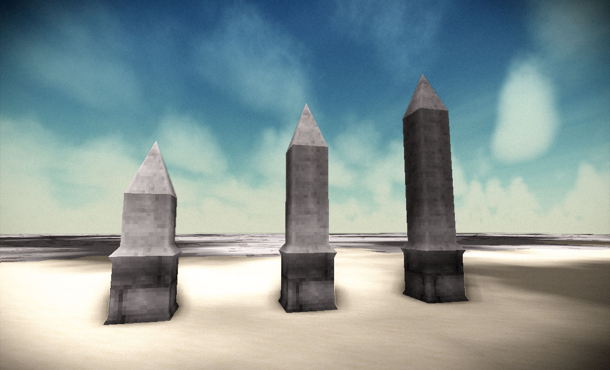

# Strcutural Resources

A modules that provides various building resources, e.g. shapes and specific textures.

## Content
Currently, the module contains the following shapes

* **Obelisk**: base, 3 pillar shapes (bottom, middle, tip)

### License

This module is licensed under the [Apache 2.0 License](http://www.apache.org/licenses/LICENSE-2.0.html).